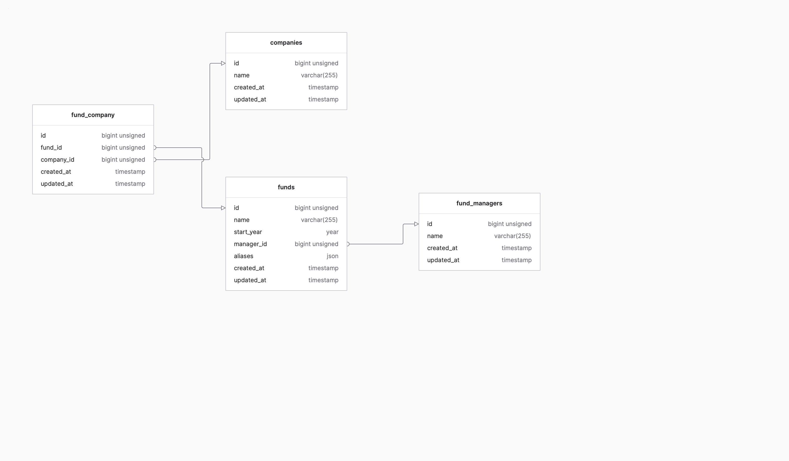

## Canoe Tech Assessment for Remotely

### Tools used:
- Backend: Laravel 10 (PHP Framework)
- RDMS: MYSQL 8.0

## Requirements
- [Docker desktop](https://www.docker.com/products/docker-desktop/)

## INSTALLATION
1. Clone this repo in your preferred directory:
```bash
git clone https://github.com/JCVillegas/CanoeTechAssessment.git
```
2. **cd** into the CanoeTechAssessment directory and copy the contents of the env.example file, into a new .env file:
```bash
cp .env.example .env
```
3. Inside the CanoeTechAssessment directory run composer:
```bash
composer install
```
4. Start docker containers:
```bash
docker-compose up
```
5. Inside the CanoeTechAssessment directory, go into the docker container:
      :
```bash
docker exec -it canoetechassessment-laravel-1 /bin/bash
```

6. Generate a new app key:
```bash
php artisan key:generate
```
7. Run the DB migrations for the app and for the tests:
```bash
php artisan migrate
php artisan migrate --database=testing

```
8. Exit the container and return to the CanoeTechAssessment directory and initiate the web server:
```bash
php artisan serve
```

9. Server will be running on: http://127.0.0.1/

## INSTRUCTIONS

### API ENDPOINTS
You can use the following api to perform certain actions:
- Create a fund:
```bash
curl --location 'http://127.0.0.1/api/funds' \
--header 'Content-Type: application/json' \
--data '{
    "fund": "fundName",
    "manager": "managerName",
    "year": "2000",
    "alias": [
        "alias1Update",
        "alias2Update",
        "alias3Update"
    ]
}'
```
- Update a fund:
```bash
curl --location --request PUT 'http://127.0.0.1/api/funds/{fundId' \
--header 'Content-Type: application/json' \
--data '{
    "fund": "fundNameUpdate",
    "manager": "managerNameUpdate",
    "year": "2023",
    "aliases": [
        "alias1Update",
        "alias2Update",
        "alias3Update"
    ]
}'
```

- List funds. (you can filter by year, fund name or manager name)
```bash
curl --location 'http://127.0.0.1/api/funds' \
```
 - Example of filter by year:
```bash
curl --location --request GET 'http://127.0.0.1/api/funds' \
--header 'Content-Type: application/json' \
--data '{
"year":1979
}'
```
- Example of filter by fund name:
```bash
curl --location --request GET 'http://127.0.0.1/api/funds' \
--header 'Content-Type: application/json' \
--data '{
"name":"JuanFund1"
}'
```
- Example of filter by manager name:
```bash
curl --location --request GET 'http://127.0.0.1/api/funds' \
--header 'Content-Type: application/json' \
--data '{
    "manager":"JuanManager1"
}'
```

** If a potential duplicate is found, the response will also include an array called PotentialDuplicates:
```bash
"potentialDuplicates": [
  {
      "fund_name": "Fund",
      "fund_id": 18,
      "manager_name": "JuanDupManager",
      "manager_id": 8,
      "fund_aliases": [
      "FundAlias1",
      "FundAlias2",
      "FundAlias3"
      ]
  }
]
```

## Running tests
1. Inside the CanoeTechAssessment directory, go into the docker container:
```bash
docker exec -it canoetechassessment-laravel-1 /bin/bash
```

2. Run the tests:
```bash
php artisan test
```

## Logging
I added a frontend interface where you can check the logs after performing any Rest request.
It will also log when the Duplicate Warning Event is triggered with a warning.
```bash
http://127.0.0.1/logs
```

## ER Diagram



## Scalability

1. How will your application work as the data set grows increasingly larger?
2. How will your application work as the # of concurrent users grows increasingly larger?

     - Some considerations to ensure optimal work:
        - Implement caching mechanisms to avoid unnecessary queries.
        - Use pagination to retrieve and display data in smaller chunks.
        - Add more servers to  handle increase load.
        - Monitor frequently to identify bottlenecks.
        - Cleanup olr or unused data.
        - Implement rate limits to control the number of requests.
        - Implement fail-over and redundancy mechanisms to ensure availability.
        - Improve error handling and logging to address any issue quickly.
        - Perform load and performance tests to identify areas of improvement.
       


